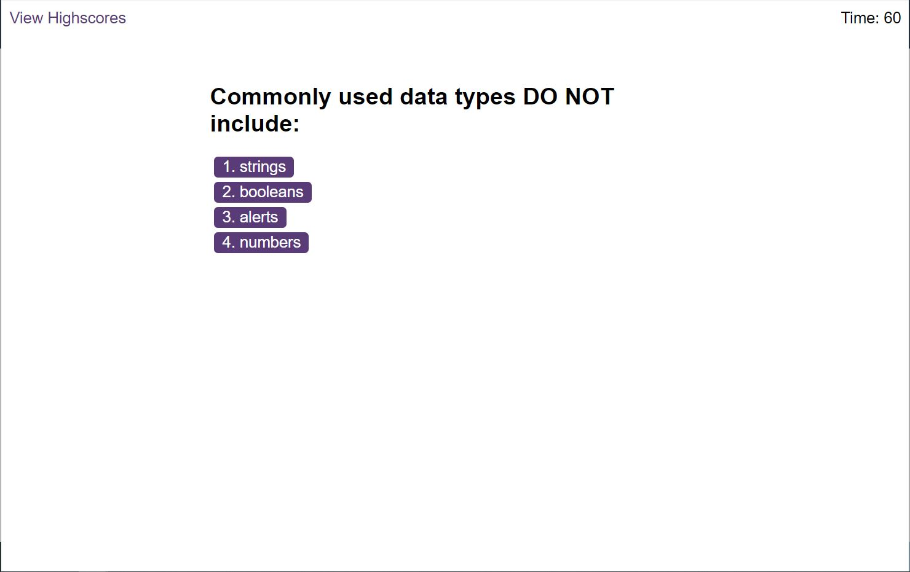

## Link to Live Application
https://500inthegraveyard.github.io/CodeQuizApp/

## Application Purpose
This is an application to help developers quiz themselves on the fundementals of JavaScript. It is a game that keeps track of the users high score.

## Start Application

In the project directory, find the index.html file and right click and open in browser.

## Screenshot

